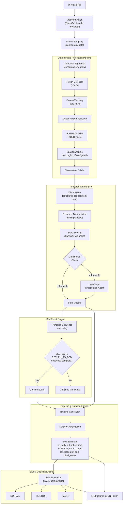
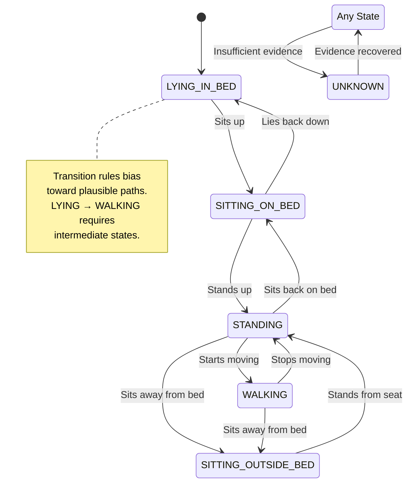
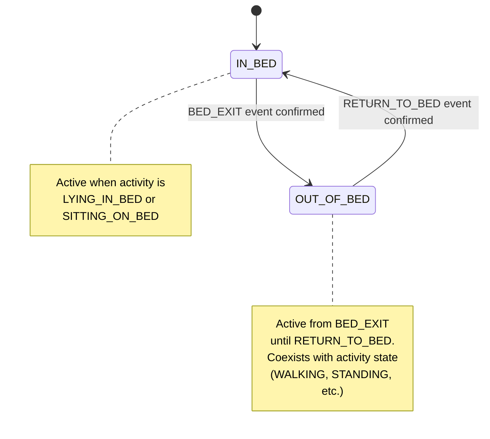
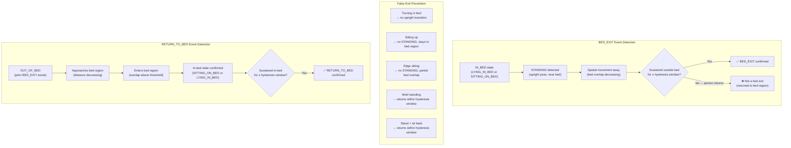
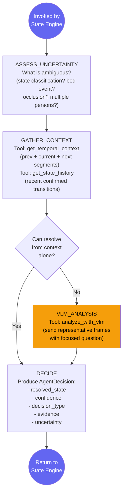
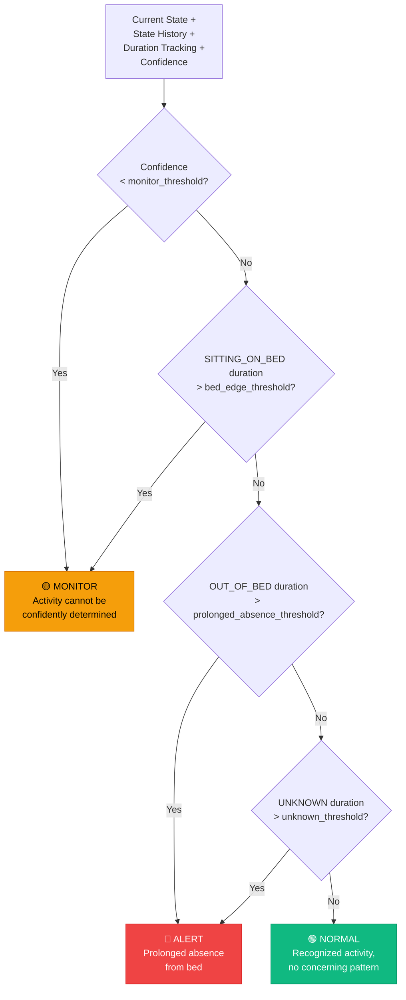
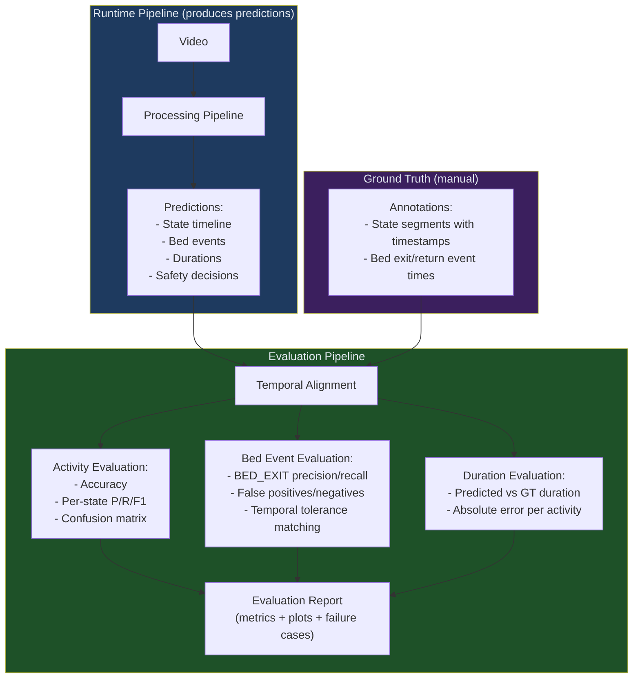

# Architecture Diagrams

All diagrams correspond to components defined in [architecture.md](architecture.md).

---

## 1. High-Level System Data Flow

---

## 2. Temporal State Engine — Dual-Dimension State Model

The system tracks two independent dimensions: **Activity State** (what the person is doing) and **Bed Context** (relationship to bed). This avoids the ambiguity of a single state field holding both `WALKING` and `OUT_OF_BED`.

### Activity State Transitions

### Bed Context Transitions

---

## 3. BED_EXIT and RETURN_TO_BED Event Logic

These are **events** confirmed by observing state transition sequences — not states themselves.

---

## 4. LangGraph Investigation Agent Workflow

The agent is invoked ONLY when the Temporal State Engine's confidence check falls below threshold. This is a single-pass workflow — it does NOT loop.

---

## 5. Safety Decision Flow

All thresholds are configurable via YAML. These are assignment-level monitoring rules, NOT medical recommendations.

---

## 6. Evaluation Pipeline

The evaluation pipeline is separate from the runtime pipeline. It compares predictions against manually created ground-truth annotations.

